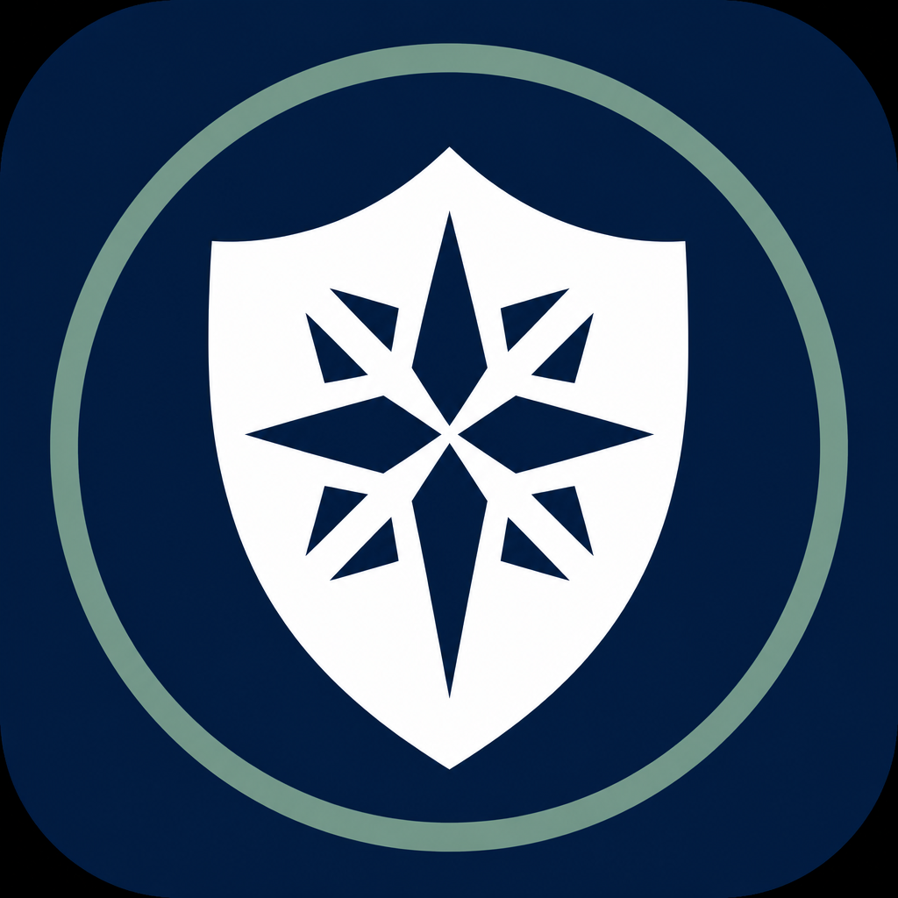
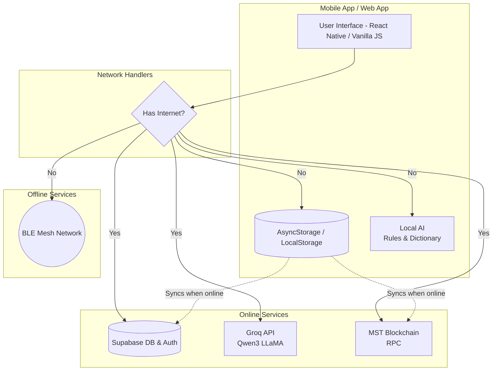

  
  <h1>Bharat Aapda Prabandhan</h1>
  
<strong>An offline-first, blockchain-anchored disaster response application for India.</strong>

  
<em>Built for Smart India Hackathon (SIH) 2026</em>

---

## 🌟 Overview

**Bharat Aapda Prabandhan** (BAP) is a resilient, offline-first mobile application designed to save lives during critical disasters. When cellular networks fail, BAP ensures communities remain connected, informed, and safe. 

By combining **Bluetooth Low Energy (BLE) Mesh Networking**, an **Offline AI Assistant**, and **Tamper-Evident Blockchain Anchoring**, BAP delivers crucial emergency services exactly when they are needed most.

---

## 🏗️ System Architecture

The architecture of BAP is designed for **maximum resilience**. It operates on a two-tier system: it prefers the cloud when online, but degrades gracefully to local, decentralized systems when offline.

---

## 🚀 Key Features

### 📡 Offline-First Communication
- **BLE Mesh Networking:** Automatically forms a decentralized Bluetooth mesh network with nearby devices to relay SOS messages and alerts without internet.
- **E2E Encrypted Chat:** Private emergency contacts communicate securely using X25519 + AES-GCM encryption.

### 🔗 MST Blockchain Anchoring
- **Tamper-Evident Alerts:** All disaster alerts are converted to hexadecimal and anchored to the **MST Blockchain (Chain ID 56001)** via zero-value transactions.
- **Offline Queueing:** Alerts created offline are queued in `AsyncStorage` and automatically pushed to the blockchain the moment the device reconnects.

### 🤖 Hybrid AI & Translation
- **Offline Mode:** Uses a curated, on-device knowledge base to answer disaster queries and a phrase dictionary for instant 12-language translation.
- **Online Mode:** Connects to **Groq (Qwen3 8-27B)** for real-time, context-aware multilingual chat and translation.

### 🌐 Lightweight Web App Version
In addition to the mobile app, a fully functional Web App is available in the `web app/` directory.
- **Stack:** Built with Vanilla HTML/JS/CSS and a Node.js + Express backend to ensure fast loading on slow connections.
- **Deployment:** Pre-configured for seamless, zero-config deployment on **Render.com**.
- **Features:** Includes a Glassmorphism UI, real-time public chat, mock-encrypted private chat, and the full Groq-powered AI suite.

### 🗺️ Real-Time Disaster Mapping
- **Interactive Map:** Displays nearby shelters, hospitals, and community-reported danger zones. 
- **Offline Cache:** Keeps a local database of critical infrastructure so users can find safety even in a blackout.

---

## 👨‍💻 Authors

- **Samridhi Parashar** — Lead Developer & UI/UX Designer
- **Aaryamann Kapoor** — Lead Developer & System Architect

*For detailed technical documentation on state management, routing, and database schemas, please refer to the [PROJECT_GUIDE.md](./PROJECT_GUIDE.md).*
